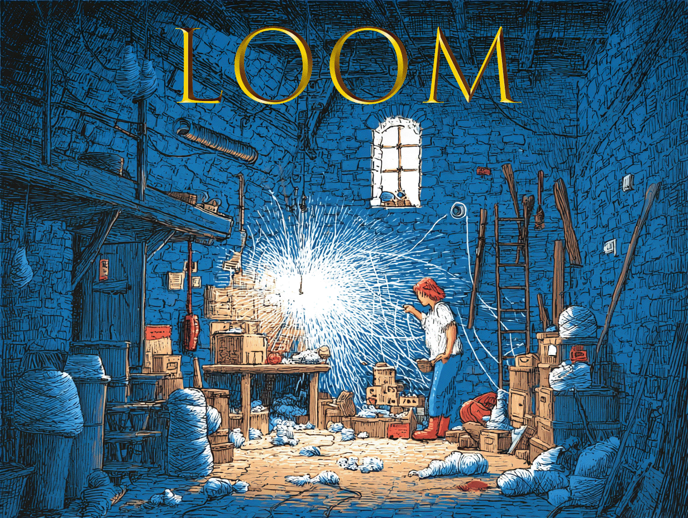

<p align="center">
  
</p>

A Claude Code plugin for building applications where `claude -p` is the runtime.

Claude Code is usually an interface — you talk to it, it writes code. But `claude -p` is something more general: a process with access to the filesystem, the shell, and a broad set of tools, capable of returning structured output conforming to any schema you define. It's an engine you can embed inside an application of your own design.

Loom teaches Claude how to build on top of that engine. The architecture is simple. A server spawns a `claude -p` process with a prompt and a JSON schema, then streams events to a frontend via SSE. What the prompt asks, what shape the schema gives, and how the interface renders it — those are yours to decide.

This is the shift from Claude Code as a coding interface to Claude Code as a runtime. You inherit everything Anthropic built into that harness — tool use, context management, streaming, model selection, cost controls — and point it at whatever you want to make.

## Architecture

```
[Interface] ←→ [Server] ←→ [claude -p]
                                ↕
                     [filesystem, shell, tools]
```

Three decisions define each app:

1. **The prompt** — what Claude should do with its access to the filesystem, shell, and tools
2. **The schema** — the shape of the output, as a JSON schema that structures Claude's response into typed data your frontend can render
3. **The interface** — how you present it

The server is a thin relay. Claude does the work. Your interface gives it form.

For a deeper walkthrough of the architecture, patterns, and design decisions, open the [interactive explainer](https://popmechanic.github.io/loom/explainer.html).

## Installation

Either:
```
/install-plugin popmechanic/loom
```
or:
```
/plugin install loom
```

## Example prompts

- "Build me something that reads my journal entries and finds threads I keep returning to"
- "Make a tool that analyzes a codebase and tells the story of how it evolved"
- "Create an app that watches a directory and narrates what's changing"

